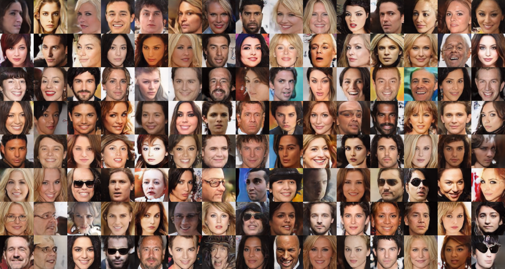

## Progressive Growing of GANs for Improved Quality, Stability, and Variation 

This repository has been forked from: https://github.com/tkarras/progressive_growing_of_gans

### Project Members:
   1. Ajay Thorve
   2. Titash Mandal
   3. Apurv Srivastav

We have added a few changes on top of this code to run for celeba and LSUN datasets, and ran the experiments on a 8 tesla k_80 GPU cluster on NYU HPC Prince.The celeba model was trained for almost 3 days(60+ hours)The LSUN bedroom model was trained for 2+ days(48+ hours).

Results folder contains the results of these two trained models

To generate the images, download the latest model file from https://drive.google.com/open?id=1btBujBTQ3mM6Ti2htT9YnsR5tUhWjR1f for either the celeba or lsun dataset,Edit the config.py file and comment out all the other datasets except the one you want to generate it for.Save the model file in a folder called results/001-your-folder-name

uncomment the following line 
<pre>train = EasyDict(func='util_scripts.generate_fake_images', run_id=1, grid_size=[15,8], num_pngs=15, image_shrink=1); num_gpus = 1; desc = 'fake-grids-' + str(train.run_id)</pre>

and then from command line, run python train.py

your generated fake images would be stored in the results folder.

the .tfevents file in the results folder can also be used to with tensorboard to visualize various tensors and graphs involved with the architecture.

Our results

 Official TensorFlow implementation of the ICLR 2018 paper</i>

**Tero Karras** (NVIDIA), **Timo Aila** (NVIDIA), **Samuli Laine** (NVIDIA), **Jaakko Lehtinen** (NVIDIA and Aalto University)

 
**Picture:** Two imaginary celebrities that were dreamed up by a random number generator.

**Abstract:** 
*We describe a new training methodology for generative adversarial networks. The key idea is to grow both the generator and discriminator progressively: starting from a low resolution, we add new layers that model increasingly fine details as training progresses. This both speeds the training up and greatly stabilizes it, allowing us to produce images of unprecedented quality, e.g., CelebA images at 1024². We also propose a simple way to increase the variation in generated images, and achieve a record inception score of 8.80 in unsupervised CIFAR10. Additionally, we describe several implementation details that are important for discouraging unhealthy competition between the generator and discriminator. Finally, we suggest a new metric for evaluating GAN results, both in terms of image quality and variation. As an additional contribution, we construct a higher-quality version of the CelebA dataset.*

## Resources

* [Paper (NVIDIA research)](http://research.nvidia.com/publication/2017-10_Progressive-Growing-of)
* [Paper (arXiv)](http://arxiv.org/abs/1710.10196)
* [Result video (YouTube)](https://youtu.be/G06dEcZ-QTg)
* [Additional material (Google Drive)](https://drive.google.com/open?id=0B4qLcYyJmiz0NHFULTdYc05lX0U)
  * [Representative images (`images/representative-images`)](https://drive.google.com/open?id=0B4qLcYyJmiz0UE9zVHduWFVORlk)
  * [High-quality video clips (`videos/high-quality-video-clips`)](https://drive.google.com/open?id=1gQu3O8ZhC-nko8wLFgcNqcwMnRYL_z85)
  * [Huge collection of non-curated  images for each dataset (`images/100k-generated-images`)](https://drive.google.com/open?id=1j6uZ_a6zci0HyKZdpDq9kSa8VihtEPCp)
  * [Extensive video of random interpolations for each dataset (`videos/one-hour-of-random-interpolations`)](https://drive.google.com/open?id=1gAb3oqpaQFHZTwPUXHPIfBIP8eIeWNrI)
  * [Pre-trained networks (`networks/tensorflow-version`)](https://drive.google.com/open?id=15hvzxt_XxuokSmj0uO4xxMTMWVc0cIMU)
  * [Minimal example script for importing the pre-trained networks (`networks/tensorflow-version/example_import_script`)](https://drive.google.com/open?id=1A79qKDTFp6pExe4gTSgBsEOkxwa2oes_)
  * [Data files needed to reconstruct the CelebA-HQ dataset (`datasets/celeba-hq-deltas`)](https://drive.google.com/open?id=0B4qLcYyJmiz0TXY1NG02bzZVRGs)
  * [Example training logs and progress snapshots (`networks/tensorflow-version/example_training_runs`)](https://drive.google.com/open?id=1A9SKoQ7Xu2fqK22GHdMw8LZTh6qLvR7H)

All the material, including source code, is made freely available for non-commercial use under the Creative Commons [CC BY-NC 4.0](https://creativecommons.org/licenses/by-nc/4.0/legalcode) license. Feel free to use any of the material in your own work, as long as you give us appropriate credit by mentioning the title and author list of our paper.

